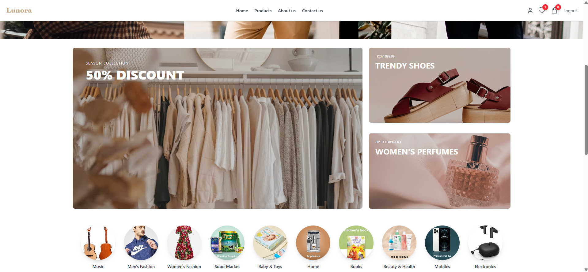
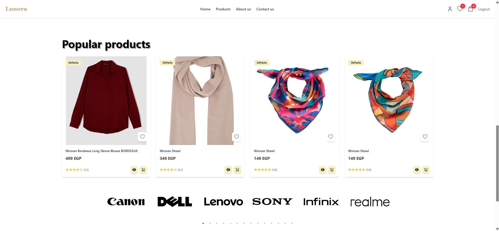
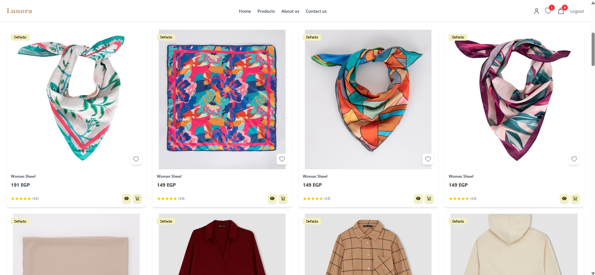
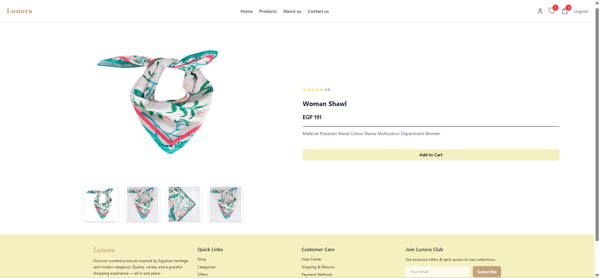
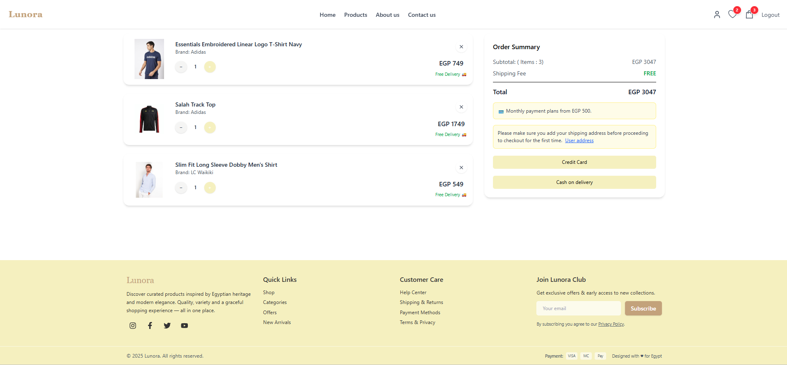
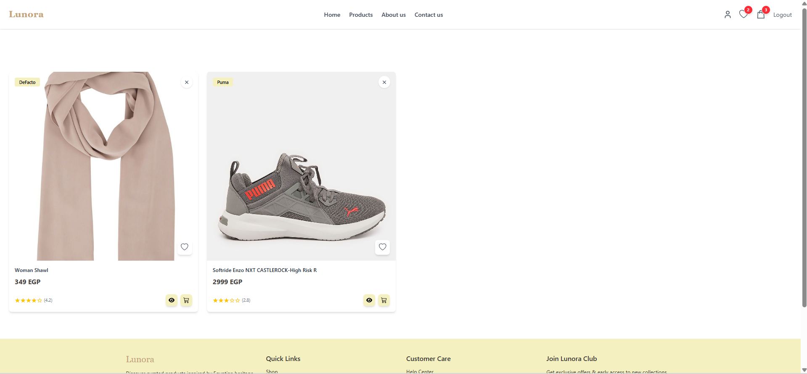

# 🛍️ Lunore Ecommerce

Lunore Ecommerce is a **simple ecommerce web application** built using **React + Vite**, offering a clean and fast user experience for browsing products, viewing product details, and managing the shopping cart.

This project uses modern React tools and libraries to ensure high performance and a smooth UI.

---


### **Frontend**
- React 19
- Vite
- React Router DOM
- React Hook Form
- TanStack React Query
- Axios
- MUI (Material UI)
- Emotion (Styled + React)
- TailwindCSS
- React Slick (Sliders)
- Lucide React / React Icons
- React Toastify
- React Spinners

---

## 📋 Prerequisites

- Node.js (v18+ recommended)
- npm or yarn

---

## 📦 Installation & Setup

### 1. Clone the project
```bash
git clone https://github.com/Doniamagdy/Lunora-Ecommerce.git
cd Lunora-Ecommerce
```

### 2. Install dependencies
```bash
npm install
```

### 3. Start the development server
```bash
npm run dev
```


---

## ✨ Features

- 🔐 User authentication (Login/Register)
- 🏠 Dynamic homepage with hero, products, and categories
- 🛍️ Browse all products with filtering
- 📄 Detailed product pages with images and descriptions
- 🛒 Shopping cart with add/remove/update quantity
- ❤️ Wishlist management
- 📦 Checkout flow

---

## 📸 Screenshots

### 🔐 1. Authentication (Login / Register)
Modern login and registration flows built with React Hook Form.


---

### 🏠 2. Home Page
The homepage displays the main hero section, featured products, categories and brands.





---

### 🛍️ 3. Products Page
Shows all products.



---

### 📄 4. Product Details
Each product has a dedicated page with description and images.



---

### 🛒 5. Shopping Cart
Users can add/remove items, update quantity, and view total cost.



---

### ❤️ 6. Wishlist
Users can add/remove items to wishlist.



---


## 🌐 Live Demo & Links

🔗 **Live Site:** [https://lunora-ecommerce.vercel.app/](https://lunora-ecommerce.vercel.app/)  
💻 **Repository:** [https://github.com/Doniamagdy/Lunora-Ecommerce](https://github.com/Doniamagdy/Lunora-Ecommerce)

---


